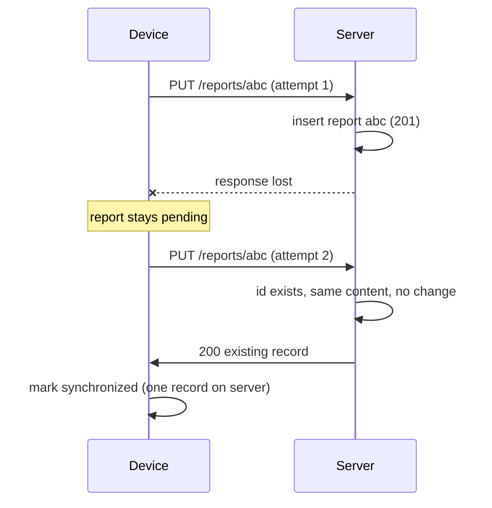

# Design Document
## Offline Field Issue Tracker

> Implements `docs/SRS.md` v1.1. The SRS says **what**; this document says **how**. Requirement IDs (FR-xxx) show what each decision serves.

---

## 1. Stack

| Layer | Choice | Why |
|---|---|---|
| Backend | Python 3.11+, FastAPI, SQLAlchemy 2.0, Pydantic v2 | Typed validation for free; small and fast to build |
| Server DB | SQLite (file) | Persistent, zero setup for reviewers; a unique primary key gives the idempotency guarantee |
| Backend tests | pytest + FastAPI TestClient (in-memory SQLite) | Fast, no external services |
| Frontend | React + Vite + TypeScript | Familiar, fast tooling |
| Local storage | IndexedDB via Dexie | Survives refresh and restart; holds structured data and a sync queue (localStorage is too small and not transactional) |
| Frontend tests | Vitest + fake-indexeddb | Tests the sync engine without a browser |

---

## 2. Architecture overview

```
┌────────────── Browser (field worker) ──────────────┐        ┌──────── Server ────────┐
│  React UI ──► Report Store (Dexie / IndexedDB)     │        │  FastAPI routes         │
│      │             ▲                               │        │     │                   │
│      ▼             │ updates sync_state            │  HTTP  │  Domain: state machine  │
│  Sync Engine ──────┴──────────────────────────────────────►│  + validation           │
│  (queue, retry, backoff, single-flight)            │        │     │                   │
└────────────────────────────────────────────────────┘        │  SQLite (reports,       │
┌────────────── Browser (coordinator) ───────────────┐        │          events)        │
│  React UI ──► API client (online only) ───────────────────►│                         │
└────────────────────────────────────────────────────┘        └─────────────────────────┘
```

Key principle: **the device is the source of truth until the server confirms receipt.** The UI never talks to the network to save a report; it writes locally first, and the sync engine delivers it afterward.

---

## 3. Data model

### 3.1 Server (SQLite)

**reports**

| Column | Type | Notes |
|---|---|---|
| id | TEXT (UUID) PK | Generated on the device; doubles as the idempotency key (FR-SYN-5) |
| category | TEXT | Enum, validated (FR-CRT-2) |
| description | TEXT | 10 to 1000 chars (FR-VAL-2) |
| location_text | TEXT | Required, max 200 chars |
| latitude, longitude | REAL, nullable | Both or neither; ranges validated (FR-VAL-3) |
| priority | TEXT | Low, Medium, High, Critical |
| status | TEXT | Submitted, Assigned, In Progress, Resolved, Rejected |
| reporter_name | TEXT, nullable | |
| reported_at | TEXT (UTC ISO 8601) | Device time, not in the future (FR-VAL-4) |
| received_at | TEXT | Server time of first receipt |
| updated_at | TEXT | Server time of last change |

**report_events** (append-only, FR-HIS-4)

| Column | Type | Notes |
|---|---|---|
| id | TEXT (UUID) PK | Generated by whoever creates the event (device or server) |
| report_id | TEXT FK | |
| type | TEXT | `created`, `submitted`, `sync_attempt_failed`, `synchronized`, `status_changed`, `transition_rejected` |
| actor_role | TEXT | `field_worker`, `coordinator`, `system` |
| occurred_at | TEXT | When it happened (device time for offline events) |
| recorded_at | TEXT | Server time it was stored |
| details | JSON | e.g. `{from, to, reason}` or `{error}` |

The event `id` is the primary key, so a re-sent event is ignored rather than duplicated.

Drafts never reach the server (A-1), so the server's status column starts at Submitted.

### 3.2 Device (IndexedDB via Dexie)

**reports table:** all report fields, plus:

| Field | Purpose |
|---|---|
| status | Draft or Submitted locally; later statuses are mirrored from the server |
| sync_state | `pending`, `synchronized`, `failed` (FR-SYN-1). Drafts are `pending` but are not sent until submitted |
| last_error | Human-readable failure reason (FR-SYN-7) |
| attempt_count, next_retry_at | Drive backoff |
| updated_locally_at | Ordering |

**events table:** the device's own history entries (created, submitted, failed attempts), each with its own UUID and a `delivered` flag. Undelivered events travel with the report on the next sync (FR-HIS-5).

An in-flight "sending" state is **not stored**. If the app is closed mid-request, the report is still `pending` on restart and is simply sent again (FR-SYN-8).

---

## 4. Status workflow

Implemented as one pure function in its own module (`workflow.py`), with no web or database code, so it is easy to test exhaustively.

| From | To | Actor | Reason |
|---|---|---|---|
| Draft | Submitted | Field worker (device only) | – |
| Submitted | Assigned | Coordinator | – |
| Submitted | Rejected | Coordinator | Required |
| Assigned | In Progress | Coordinator | – |
| Assigned | Rejected | Coordinator | Required |
| In Progress | Resolved | Coordinator | – |

Everything else is invalid, including all moves out of Resolved or Rejected (A-5, A-6).

**Invalid transition handling (FR-WFL-3):** the server returns `409 INVALID_TRANSITION`, leaves the status unchanged, **still writes a `transition_rejected` event**, and the UI shows the message. Wrong role returns `403`. A missing reason returns `422`.

**Concurrent coordinators (FR-WFL-6):** a transition request carries `expected_status`. If the report's current status differs, the server returns `409 STALE_STATUS` and the UI refreshes. The status check and update run in one database transaction.

---

## 5. API

Roles are simulated: the client sends `X-Role: field_worker | coordinator`. This is a stand-in for authentication, not a security control, and the README says so.

| Method and path | Purpose | Success | Errors |
|---|---|---|---|
| `PUT /reports/{id}` | Idempotent delivery of a submitted report (with its undelivered events) | `201` created, or `200` if the id already exists with the same content | `422` validation; `409 ID_CONTENT_MISMATCH` if the id exists with different content |
| `GET /reports` | List reports, filterable by status, priority, category, and `ids=` | `200` | |
| `GET /reports/{id}` | Report plus ordered history | `200` | `404` |
| `POST /reports/{id}/transition` | Body: `{to, reason?, expected_status}` | `200` updated report | `403`, `404`, `409`, `422` |
| `GET /health` | Used by the client's connectivity check | `200` | |

**Idempotency rule for PUT:**
1. If the id does not exist, validate, insert the report and its events, add a server `synchronized` event, and return `201`.
2. If the id exists with identical content, change nothing and return `200` with the stored report. A retry after a lost response therefore looks like a success to the client.
3. If the id exists with different content, return `409` (this should never happen with a correct client, and it protects against silent overwrite).
4. A concurrent duplicate insert hits the primary key; the server catches the integrity error, re-reads, and handles it as case 2.

Error responses share one shape: `{ "code": "...", "message": "...", "fields": { "description": "..." } }`.

---

## 6. Synchronization design

### 6.1 Triggers
`online` browser event, the manual **Sync now** button, a 30 second timer while anything is pending, and app start. A browser's `online` flag is unreliable, so success is decided by actual request results, not by that flag.

### 6.2 Algorithm (one run)
1. If a run is already active, return (single-flight, FR-SYN-10). `navigator.locks` is used when available so two tabs do not run together. The server's idempotency covers any remaining overlap.
2. Select reports that are Submitted and `pending` (plus `failed` ones only if the user pressed retry).
3. For each, `PUT /reports/{id}` with the report and its undelivered events.
4. Handle the result:

| Result | Action |
|---|---|
| `200` / `201` | In **one** local transaction: mark `synchronized`, store server fields, mark events delivered, clear `last_error`. Only now is the report considered delivered (FR-SYN-6) |
| Network error or timeout, `5xx` | Stay `pending`; record a `sync_attempt_failed` event; increase `attempt_count`; schedule backoff (2s, 4s, 8s … max 60s, with jitter) |
| `422` | Mark `failed` with the field messages; do **not** retry automatically (FR-SYN-7) |
| `409 ID_CONTENT_MISMATCH` | Mark `failed` with an explanatory message |

5. After sending, fetch current statuses for synchronized reports (`GET /reports?ids=...`) so the worker sees coordinator progress.

### 6.3 The instructor's scenario: server saved, response lost


### 6.4 Interrupted sync
Nothing is persisted as "in progress", so a crash or closed tab leaves reports `pending`. They are re-sent on the next trigger, and the idempotent `PUT` makes that safe.

### 6.5 Why this is safe against data loss
The local copy is never deleted or overwritten by a server response unless the response confirms receipt, and reports have no delete operation (A-9).

---

## 7. Validation and errors

- **Backend (authoritative):** Pydantic models with enums, length limits, coordinate pair and range checks, and the reported-at-not-in-future rule (with a few minutes of clock tolerance). All violations are returned together, keyed by field.
- **Frontend:** the same rules run before saving locally, so the worker fixes problems immediately; the server still re-validates (FR-VAL-5).
- **UI errors:** field-level messages on the form, a banner for connectivity, and a reason on every Failed report.

---

## 8. Conflict handling (for the README)

Not required in the minimum scope, because submitted reports are read-only for field workers. If post-submission editing were added:
- Add an integer `version` to reports, incremented on every change, and return it with every response.
- Edits send the `version` they were based on; the server accepts only if it matches (compare-on-write) and otherwise returns `409` with the current server version.
- The client keeps the local edit as a `conflict` state and shows both versions side by side, so the user chooses to keep theirs (resubmitted on top of the new version), accept the server's, or merge field by field.
- Silent last-write-wins is avoided because it loses a coordinator's or worker's data.

---

## 9. Code layout

```
/backend
  app/main.py            FastAPI app, routes, error handlers
  app/schemas.py         Pydantic request and response models
  app/models.py          SQLAlchemy tables
  app/workflow.py        pure state machine (no I/O)
  app/service.py         idempotent upsert, transitions, history writing
  app/seed.py            demonstration data
  tests/
/frontend
  src/db.ts              Dexie schema
  src/syncEngine.ts      queue, retry, backoff, single-flight (no React)
  src/api.ts             HTTP client
  src/components/        form, list, detail, badges, role switch
  src/tests/
/docs                    SRS.md, DESIGN.md
README.md
```

---

## 10. Test plan and priorities

Priorities follow the risk: data loss and duplicates first, then rules, then everything else.

| Priority | Test | Layer |
|---|---|---|
| 1 | Same report sent twice gives one record (200 on retry) | Backend |
| 1 | Server saves, response is lost, retry succeeds with no duplicate | Frontend, with a fake network |
| 1 | Network error leaves report `pending` and data intact | Frontend |
| 1 | Reports persist in local storage after a simulated reload | Frontend |
| 2 | Every valid transition passes; every invalid one is refused and logged | Backend (unit) |
| 2 | Wrong role is refused; stale `expected_status` is refused | Backend |
| 2 | Validation rejects bad input, and a `422` makes a report `failed` with no auto-retry | Both |
| 3 | History events are created for each action and are not duplicated by retries | Backend |
| 3 | Same id with different content returns 409 | Backend |

UI rendering is checked manually through the QA checklist, not with heavy UI tests.

---

## 11. Assumptions about the environment
- Server timestamps are UTC; the UI converts to local time.
- SQLite is adequate for the exercise; a production system would use a server database and migrations.
- Role simulation offers no security, and this is stated openly in the README.
